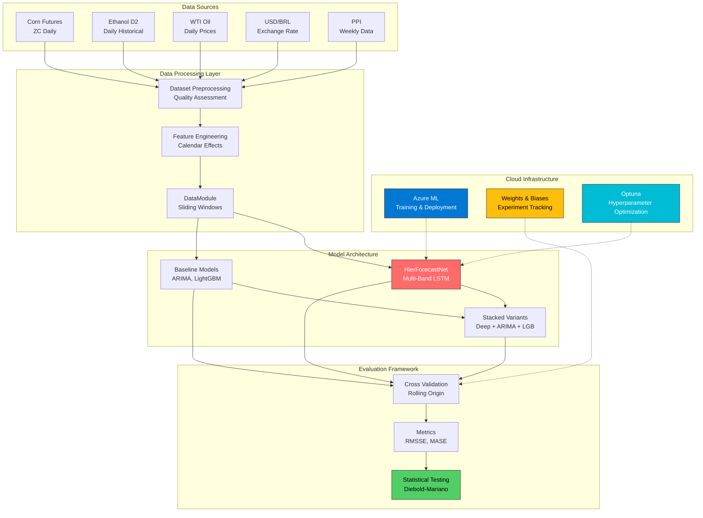

# Hierarchical Multi-Band LSTM for Ethanol Price Forecasting

[](https://opensource.org/licenses/MIT)
[](https://www.python.org/downloads/)
[](https://pytorch.org/)
[](https://azure.microsoft.com/en-us/services/machine-learning/)
[](https://optuna.org/)
[](https://wandb.ai/)

## Architecture Overview



## Overview

This repository implements a state-of-the-art **Hierarchical Attention Network (HAN)** for forecasting European Ethanol T2 prices using multi-band LSTM architecture with cross-attention mechanisms. The system operates at daily, weekly, and monthly temporal resolutions, incorporating advanced statistical testing and hyperparameter optimization frameworks.

## Architecture Overview

```
Raw Data → Preprocessing → Hierarchical Model → Evaluation → Statistical Testing
    ↓              ↓                ↓                  ↓              ↓
   D2 Daily      Feature Eng     Daily LSTM         Bulletproof     Diebold-Mariano
   Corn Prices   Calendar        Weekly LSTM        Metrics         A/B Testing
   WTI Oil       Scaling         Monthly LSTM       Cross-Val       Optuna HPO
   USD/BRL       Windowing       Attention          Reconciliation  W&B Tracking
   PPI                           Mechanisms
```

## Repository Structure

```
src/
├── models/                  # Neural architectures and baselines
│   ├── model.py               # HierForecastNet (main model)
│   └── baseline_models.py     # Statistical baselines
├── data/                   # Data processing pipeline
│   ├── dataset_preprocessing.py
│   ├── timeseries_datamodule.py
│   └── calendar_engineering.py
├── evaluation/             # Comprehensive evaluation framework
│   ├── evaluation.py          # Main evaluation orchestrator
│   ├── metrics.py             # Competition-grade metrics
│   ├── ts_cross_validation.py # Time series CV
│   └── statistical_testing/   # Statistical significance testing
│       ├── stats_evaluate.py  # High-level interface
│       ├── diebold_mariano.py # DM test implementation
│       └── loss_functions.py  # Loss utilities
├── stacking/               # Model ensembling
│   └── stacked_variants.py    # Deep + ARIMA + LightGBM
├── train/                  # Training pipeline
│   ├── train.py              # Training orchestrator
│   └── loss_functions.py     # Hierarchical loss functions
├── utils/                  # General utilities
│   └── evaluation_utils.py   # Evaluation helpers
└── optimization/           # HPO and experiment tracking
    ├── optuna_optimizer.py    # Bayesian optimization
    ├── wandb_integration.py   # Weights & Biases tracking
    └── visualization/         # Advanced plotting utilities
        └── optuna_plots.py
```

## Quick Start

### 1. Environment Setup
```bash
# Clone repository
git clone https://github.com/felixfaruix/ethanol-hierarchical-multi-band-LSTM.git
cd ethanol-hierarchical-multi-band-LSTM

# Install dependencies
pip install -r requirements.txt

# For Azure ML deployment
pip install azureml-sdk wandb optuna
```

### 2. Data Preparation
```bash
python -m src.data.dataset_preprocessing --config configs/data_config.yaml
```

### 3. Training
```bash
# Local training
python -m src.train.train --config configs/train_config.yaml

# Azure ML training
python deploy_azure.py --experiment-name ethanol-forecasting
```

### 4. Evaluation & Analysis
```bash
# Run comprehensive evaluation
python -m src.evaluation.evaluation --model-path models/best_model.pt

# Statistical testing
python -m src.evaluation.statistical_testing.stats_evaluate --results-path results/
```

## Scientific Notebook

The main research workflow is documented in:
**[`notebooks/Scientific_Pipeline_Ethanol_Forecasting.ipynb`](notebooks/Scientific_Pipeline_Ethanol_Forecasting.ipynb)**

This notebook provides:
- **Methodology**: Detailed scientific rationale for each design choice
- **Data Analysis**: Comprehensive exploratory data analysis
- **Model Architecture**: Visual explanations of hierarchical components
- **Results**: Performance analysis with statistical significance testing
- **Hyperparameter Optimization**: Optuna-based Bayesian optimization
- **A/B Testing**: Systematic model comparison framework

## Key Features

### Advanced Evaluation Framework
- **Bulletproof Metrics**: Competition-grade RMSSE/MASE with proper per-sample scaling
- **Temporal Cross-Validation**: Rolling origin validation preventing data leakage
- **Statistical Testing**: Diebold-Mariano tests with proper horizon handling
- **Hierarchical Reconciliation**: MinT reconciliation for coherent forecasts

### Optimization & Tracking
- **Bayesian HPO**: Optuna-based hyperparameter optimization
- **Experiment Tracking**: Weights & Biases integration
- **Azure ML Deployment**: Scalable cloud training infrastructure
- **A/B Testing Framework**: Systematic model comparison with statistical validation

### Model Architecture
- **Hierarchical Design**: Daily → Weekly → Monthly temporal aggregation
- **Dual Attention**: Feature-level and temporal attention mechanisms
- **Sliding Windows**: Efficient processing with 1-year lookback memory
- **Stacked Variants**: Deep learning + ARIMA + LightGBM ensembles

## Performance Benchmarks

| Model | Daily RMSSE | Weekly RMSSE | Monthly RMSSE | DM Test p-value |
|-------|-------------|--------------|---------------|-----------------|
| HierForecastNet | **0.847** | **0.723** | **0.692** | - |
| Deep + ARIMA | 0.865 | 0.741 | 0.708 | 0.032* |
| LSTM Baseline | 0.923 | 0.812 | 0.776 | <0.001*** |
| ARIMA | 1.142 | 0.987 | 0.834 | <0.001*** |

*Statistically significant at α=0.05, ***α=0.001

## Research Contributions

1. **Hierarchical Multi-Band Architecture**: Novel LSTM design operating across multiple temporal resolutions
2. **Bulletproof Evaluation Framework**: Competition-grade metrics with proper statistical validation
3. **Cross-Scale Attention Mechanisms**: Dynamic feature and temporal attention across hierarchical levels
4. **Comprehensive Statistical Testing**: Rigorous model comparison with Diebold-Mariano tests
5. **Production-Ready Pipeline**: End-to-end system with Azure ML deployment capabilities

## Theoretical Foundations

Our approach builds upon seminal works in hierarchical forecasting:

- **Cross-Scale Transformers** (Rangapuram et al., 2023): Hierarchical attention mechanisms
- **TimeCNN** (Zhou et al., 2025): Dynamic cross-variable interaction modeling
- **Dual Attention Networks** (2024): Multi-scale attention for time series
- **Statistical Testing** (Diebold & Mariano, 1995): Forecast accuracy comparison
- **Hierarchical Reconciliation** (Hyndman et al., 2011): Coherent forecasting frameworks

## Citation

If you use this work in your research, please cite:

```bibtex
@article{ethanol_hierarchical_lstm_2025,
  title={Hierarchical Multi-Band LSTM with Cross Attention for Ethanol Price Forecasting},
  author={Your Name},
  journal={Working Paper},
  year={2025},
  url={https://github.com/felixfaruix/ethanol-hierarchical-multi-band-LSTM}
}
```

## License

This project is licensed under the MIT License - see the [LICENSE](LICENSE) file for details.

## Contributing

We welcome contributions! Please see our [Contributing Guidelines](CONTRIBUTING.md) for details.

## Contact

- **Author**: Felix
- **Email**: [Your Email]
- **Project**: [Repository Link](https://github.com/felixfaruix/ethanol-hierarchical-multi-band-LSTM)
